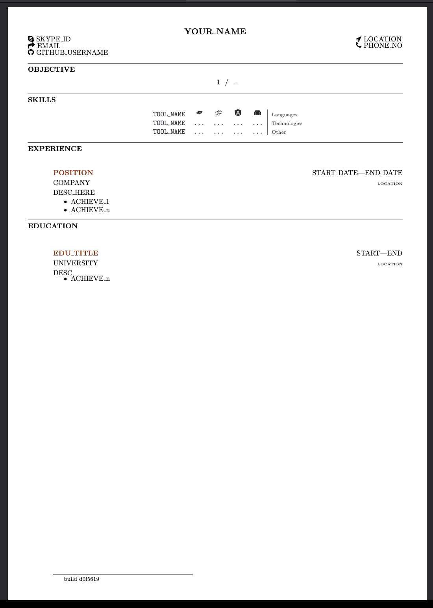

# Resume

Old school resume using latex and res.

Requirenments:
- VSCode
- Devcontainer extension
- Docker

## Build inside container
```
make all
```
Will output a pdf file with your name.

## Build with vscode latex 
Press the build button when opening the `resume.tex`.


